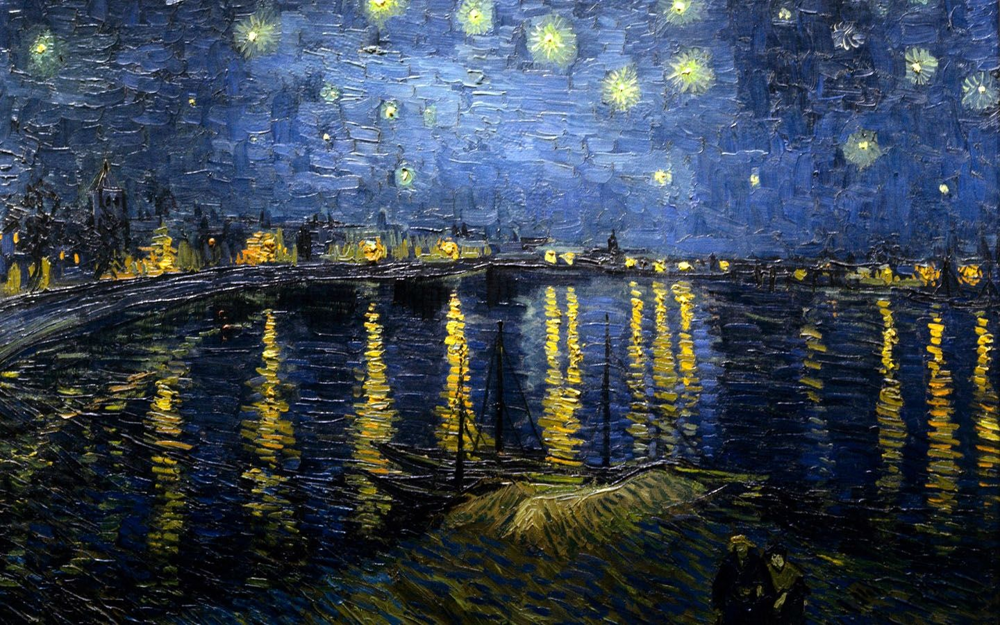

# MusicPlayer

MusicPlayer is a simple web-based music player that allows users to play, pause, and navigate through a playlist of songs with an attractive and modern interface.

## Features

- Play and pause music tracks.
- Display a song list with cover images.
- Progress bar to show current playback position.
- Animated visuals and responsive layout.
- Custom background video for enhanced aesthetics.
- Spotify playlist embed support.

## Technologies Used

- **HTML5** for structure (`MH.html`, `laterON.html`)
- **CSS3** for styling and responsive design (`style.css`)
- **JavaScript** for interactivity and player controls (`script.js`)
- **Font Awesome** for player icons
- **Media assets** (audio `.mp3`, image `.png`, `.jpg`, `.gif`, video `.mp4`) for UI and background

## How It Works

The main music player interface is built in `MH.html` and `laterON.html`. It displays a list of songs, each with its own play button and cover art. The playback is controlled by `script.js`, which manages audio playback and UI updates:

- The play/pause button toggles playback of the selected track.
- The progress bar updates as the song plays.
- Animated GIFs and background videos provide visual feedback and enhance user experience.
- The playlist and song data are managed as JavaScript objects in `script.js`.

## Getting Started

1. Clone this repository.
2. Open `MH.html` or `laterON.html` in your browser.
3. Enjoy playing the available songs!

## Screenshots

## License

This project is for educational and personal use.
